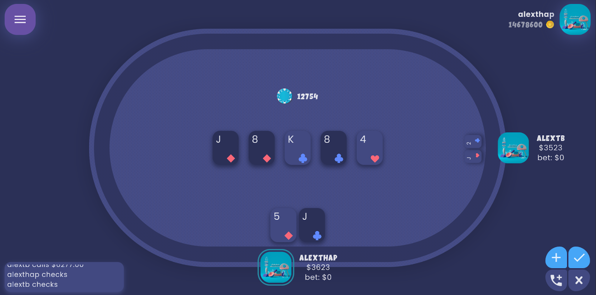

# Alex Poker



Đây là dự án game poker sử dụng Flutter. Game được thiết kế đơn giản và dễ chơi, phù hợp cho cả những người mới bắt đầu chơi poker.

## Play Screen


## Lobby Animation


## Cài đặt
Clone repository này.
Chạy lệnh flutter packages get để cài đặt các dependencies.
```code
flutter packages get
```
Chạy lệnh flutter run để khởi chạy ứng dụng trên máy tính của bạn hoặc flutter build để build thành file APK hoặc IPA để cài đặt trên thiết bị di động.
```code
flutter run
```
Yêu cầu: Bạn cần cài đặt Flutter và Android Studio trước khi chạy ứng dụng.

## Tác giả
Alex Poker được phát triển bởi Alex Cao.


